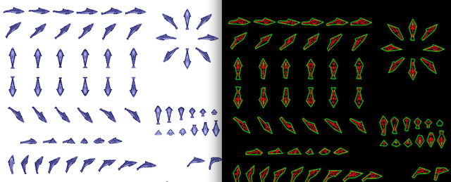

# Autocenter

Autocenter is a utility to convert random video game atlas sprite sheets into seperate files per animation frame automatically centered in the sub-image. These seperated images will then be re-combined into a new, more usuable, format with either a simple grid system of another texture packer format consumable by web apps. It uses opencv to detect the contours of object in the source image, and then extracts each region-of-interest into a set of new images.

